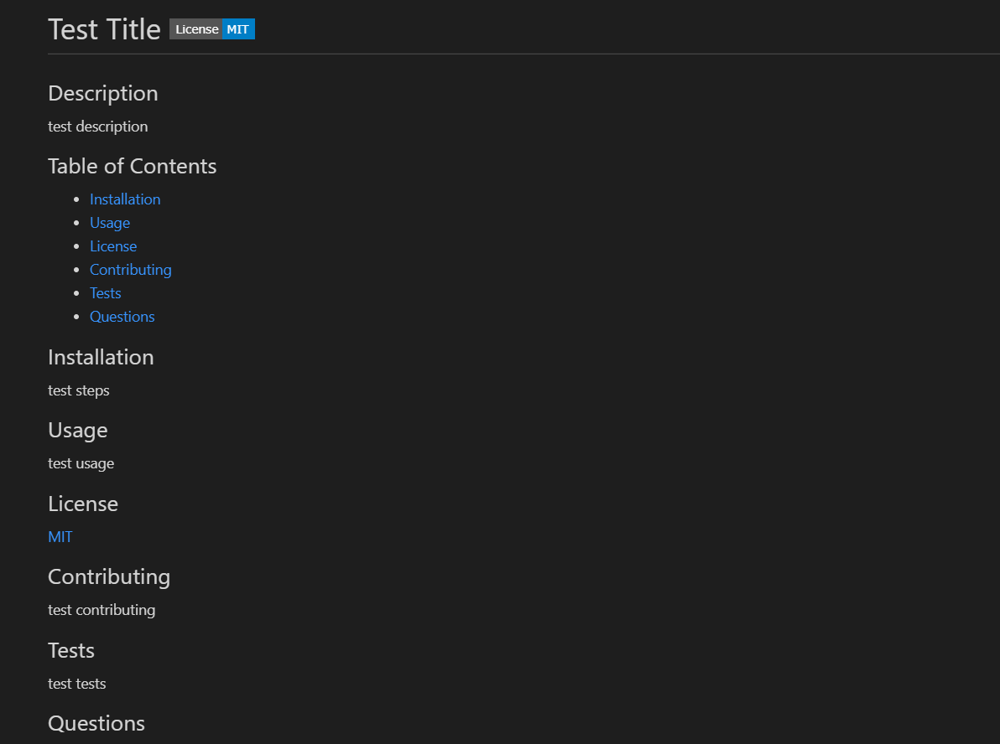

# README Generator

## Description

This app is an easy way for developers to quickly generate a quality README.md file for their projects. This will allow them to spend more time on development while still including an integral part of a high-quality repo.

## Installation

Download the repo and copy the files into the directory of your choosing. Open the terminal and make sure you're in the "readme-generator" directory. You're now ready to run the app!

## Usage

In the terminal, type "node index.js" and answer the following prompts. After each prompt is complete, a generatedREADME file will appear in the root directory. You may now use the README file for your project! This readme will include clickable links to your Github account, email, and for more information about the license. It will also include a table of contents for easy access. [Click here for a walkthrough video.](https://drive.google.com/file/d/1UEfcYHGRZf2_DnKUeL79DO5qy-asTZNC/view)

## Credits

- [Choose a License](https://choosealicense.com/)
- [Shields.io](https://shields.io/)
